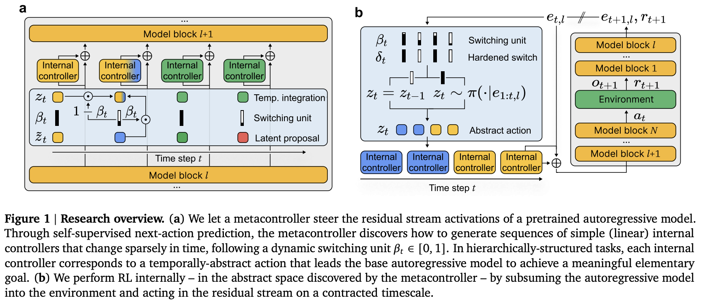

</img>

## metacontroller

Implementation of the MetaController proposed in [Emergent temporal abstractions in autoregressive models enable hierarchical reinforcement learning](https://arxiv.org/abs/2512.20605), from the Paradigms of Intelligence team at Google

## Install

```shell
$ pip install metacontroller-pytorch
```

## Appreciation

- [Pranoy](https://github.com/pranoyr) for submitting a pull request for fixing the previous latent action not being included in the inputs to the switching unit

- [Diego Calanzone](https://github.com/ddidacus) for proposing testing on BabyAI gridworld task, and submitting the [pull request](https://github.com/lucidrains/metacontroller/pull/3) for behavior cloning and discovery phase training for it!

- [Andrew Song](https://github.com/andrewsonga) for ongoing implementation of the PinPad environment!

- [Diego Calanzone](https://github.com/ddidacus) for his experimental acumen, bringing the project to an initial [working state](https://github.com/lucidrains/metacontroller/pull/13) for the BabyAI environment!

- [Andrew Song](https://github.com/andrewsonga) for implementing linear probing and fixing an issue with the action space

- [Andrew Song](https://github.com/andrewsonga) for identifying a critical issue with past action embed handling and detaching gradients of target states

- [Diego Calanzone](https://github.com/ddidacus) for identifying inconsistencies in the MetaController

- [Diego Calanzone](https://github.com/ddidacus) for replicating interpretable temporal segmentation for the BabyAI gridworld task!

## Usage

```python
import torch
from metacontroller import Transformer, MetaController

# 1. initialize model

model = Transformer(
    dim = 512,
    action_embed_readout = dict(num_discrete = 4),
    state_embed_readout = dict(num_continuous = 384),
    lower_body = dict(depth = 2),
    upper_body = dict(depth = 2)
)

state = torch.randn(2, 128, 384)
actions = torch.randint(0, 4, (2, 128))

# 2. behavioral cloning (BC)

state_loss, action_loss = model(state, actions)
(state_loss + action_loss).backward()

# 3. discovery phase

meta_controller = MetaController(
    dim_model = 512,
    dim_meta_controller = 256,
    dim_latent = 128
)

state_pred_loss, action_recon_loss, kl_loss, aux_ratio_loss = model(
    state,
    actions,
    meta_controller = meta_controller,
    discovery_phase = True
)

# they did not use state pred loss in the paper (weight set to 0, but available)
# the ratio loss from h-net paper is also available, but optional (set ratio_loss_weight > 0)

(action_recon_loss + kl_loss * 0.1).backward()

# 4. internal rl phase (GRPO)

# ... collect trajectories ...

logits, cache = model(
    one_state,
    past_action_id,
    meta_controller = meta_controller,
    return_cache = True
)

meta_output = cache.prev_hiddens.meta_controller
old_log_probs = meta_controller.log_prob(meta_output.action_dist, meta_output.actions)

# ... calculate advantages ...

# for GRPO, the inputs to policy loss should be of shape (batch, seq, dim_latent)
# where dim_latent is the dimension of the latent action space

loss = meta_controller.policy_loss(
    group_states,
    group_old_log_probs,
    group_latent_actions,
    group_advantages,
    group_switch_betas
)

loss.backward()
```

Or using [evolutionary strategies](https://arxiv.org/abs/2511.16652) for the last portion

```python
# 5. evolve (ES over GRPO)

model.meta_controller = meta_controller

def environment_callable(model):
    # return a fitness score
    return 1.0

model.evolve(
    num_generations = 10,
    environment = environment_callable
)
```

## Contributing

To install the dependencies for testing, run

```shell
$ uv sync --extra test
```

To run the tests with pytest, run

```shell
$ uv run pytest
```

## Citations

```bibtex
@misc{kobayashi2025emergenttemporalabstractionsautoregressive,
    title   = {Emergent temporal abstractions in autoregressive models enable hierarchical reinforcement learning},
    author  = {Seijin Kobayashi and Yanick Schimpf and Maximilian Schlegel and Angelika Steger and Maciej Wolczyk and Johannes von Oswald and Nino Scherrer and Kaitlin Maile and Guillaume Lajoie and Blake A. Richards and Rif A. Saurous and James Manyika and Blaise Agüera y Arcas and Alexander Meulemans and João Sacramento},
    year    = {2025},
    eprint  = {2512.20605},
    archivePrefix = {arXiv},
    primaryClass = {cs.LG},
    url     = {https://arxiv.org/abs/2512.20605},
}
```

```bibtex
@article{Wagenmaker2025SteeringYD,
    title   = {Steering Your Diffusion Policy with Latent Space Reinforcement Learning},
    author  = {Andrew Wagenmaker and Mitsuhiko Nakamoto and Yunchu Zhang and Seohong Park and Waleed Yagoub and Anusha Nagabandi and Abhishek Gupta and Sergey Levine},
    journal = {ArXiv},
    year    = {2025},
    volume  = {abs/2506.15799},
    url     = {https://api.semanticscholar.org/CorpusID:279464702}
}
```

```bibtex
@misc{hwang2025dynamicchunkingendtoendhierarchical,
    title   = {Dynamic Chunking for End-to-End Hierarchical Sequence Modeling},
    author  = {Sukjun Hwang and Brandon Wang and Albert Gu},
    year    = {2025},
    eprint  = {2507.07955},
    archivePrefix = {arXiv},
    primaryClass = {cs.LG},
    url     = {https://arxiv.org/abs/2507.07955},
}
```

```bibtex
@misc{fleuret2025freetransformer,
    title     = {The Free Transformer},
    author    = {François Fleuret},
    year      = {2025},
    eprint    = {2510.17558},
    archivePrefix = {arXiv},
    primaryClass = {cs.LG},
    url       = {https://arxiv.org/abs/2510.17558},
}
```

```bibtex
@misc{hafner2025trainingagentsinsidescalable,
    title   = {Training Agents Inside of Scalable World Models},
    author  = {Danijar Hafner and Wilson Yan and Timothy Lillicrap},
    year    = {2025},
    eprint  = {2509.24527},
    archivePrefix = {arXiv},
    primaryClass = {cs.AI},
    url     = {https://arxiv.org/abs/2509.24527},
}
```

```bibtex
@article{Pagnoni2024ByteLT,
    title   = {Byte Latent Transformer: Patches Scale Better Than Tokens},
    author  = {Artidoro Pagnoni and Ram Pasunuru and Pedro Rodriguez and John Nguyen and Benjamin Muller and Margaret Li and Chunting Zhou and Lili Yu and Jason Weston and Luke S. Zettlemoyer and Gargi Ghosh and Mike Lewis and Ari Holtzman and Srinivasan Iyer},
    journal = {ArXiv},
    year    = {2024},
    volume  = {abs/2412.09871},
    url     = {https://api.semanticscholar.org/CorpusID:274762821}
}
```

```bibtex
@article{kaddour2026target,
    title   = {Target Policy Optimization},
    author  = {Kaddour, Jean},
    journal = {arXiv preprint arXiv:2604.06159},
    year    = {2026}
}
```

```bibtex
@misc{teoh2026nextlatentpredictiontransformerslearn,
    title   = {Next-Latent Prediction Transformers Learn Compact World Models},
    author  = {Jayden Teoh and Manan Tomar and Kwangjun Ahn and Edward S. Hu and Tim Pearce and Pratyusha Sharma and Akshay Krishnamurthy and Riashat Islam and Alex Lamb and John Langford},
    year    = {2026},
    eprint  = {2511.05963},
    archivePrefix = {arXiv},
    primaryClass = {cs.LG},
    url     = {https://arxiv.org/abs/2511.05963},
}
```

*Life can only be understood backwards; but it must be lived forwards* - Søren Kierkegaard
